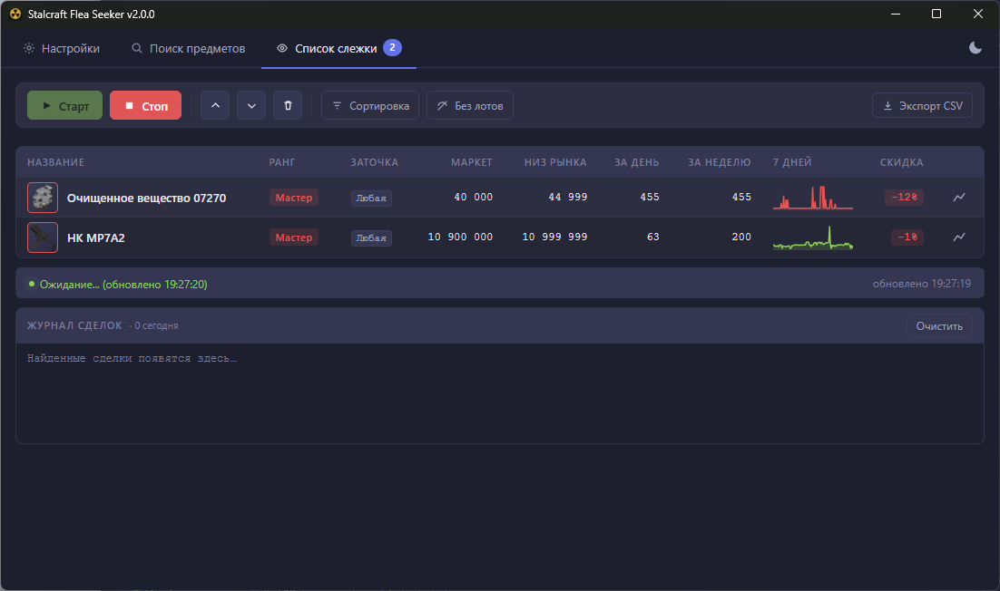

# Stalcraft Flea Seeker

[Поддержать автора (DonationAlerts)](https://www.donationalerts.com/r/bezdarnosti1)

Десктопная утилита для мониторинга аукциона StalCraft. Следит за нужными предметами, сравнивает текущую цену выкупа со средней по рынку и оповещает, когда что-то продаётся заметно дешевле обычного.



## Что умеет

- Поиск по базе предметов игры (9000+ штук, с иконками и цветами редкости), история последних запросов
- В результатах поиска сразу показывает маркет, низ рынка и количество доступных лотов
- Список слежки с фильтром по уровню заточки (+0 до +15 или любая), сортировка по имени/рынку/цене/скидке/продажам
- Кнопка «Скрыть без лотов» — прячет позиции без активных предложений
- Непрерывный опрос API аукциона — маркет (медиана), низ рынка, продажи за день/неделю
- Мини-график истории цен в таблице: зелёный при падении цены, красный при росте
- Детальный график по двойному клику с кроссхэром и медианой
- Строки с алертом подсвечиваются красным фоном
- Звуковой сигнал и выделение окна при найденной сделке (можно отключить)
- Автозапуск монитора при старте приложения (настраивается)
- Автоматическая проверка подключения к API при запуске (если ключи встроены)
- Количество найденных сделок в заголовке окна, журнал сделок с экспортом в CSV
- Сброс настроек к значениям по умолчанию одной кнопкой
- Быстрый доступ к папке данных, экспорт логов, просмотр лицензии — прямо из «О программе»
- Тёмная и светлая тема
- Проверка обновлений при запуске и каждые 5 минут

## Готовый exe

Скачать последнюю версию можно на странице [Releases](https://github.com/bezdarnosti-yt/Stalcraft-Flea-Seeker/releases). Распакуйте zip и запустите `calcraft-bot.exe` из папки.

## Запуск из исходников

Требования: Python 3.11+

```
pip install PyQt6 PyQt6-WebEngine requests
python main.py
```

## Настройка

1. Получите API-ключи на [портале разработчиков StalCraft](https://eapi.stalcraft.net)
2. Запустите приложение
3. Введите Client ID и Client Secret во вкладке «Настройки»
4. Нажмите «Проверить API» — убедитесь, что ключи работают
5. Настройки сохраняются автоматически

## Использование

**Поиск предметов** — введите минимум 2 символа, фильтруйте по рангу и уровню заточки, нажмите «В список слежки». Стрелка в поле поиска открывает историю последних запросов. После отображения результатов автоматически подгружаются цены (маркет, низ рынка, кол-во лотов) для первых 15 позиций.

**Список слежки** — нажмите «Старт». Таблица обновляется каждый цикл: маркет, низ рынка, продажи за день/неделю. Лоты ниже порога подсвечиваются красным. Двойной клик по строке открывает детальный график цен. Кнопка «Сортировка» в тулбаре сортирует список; кнопка «Без лотов» скрывает строки без активных предложений.

## Параметры

| Параметр | По умолчанию | Описание |
|---|---|---|
| Интервал | 30 с | Как часто проверять каждый предмет |
| Порог | 0.70 | Алерт если цена < X × медиана (0.7 = скидка 30%) |
| Звук | Вкл | Системный сигнал при найденной сделке |
| Автозапуск | Выкл | Запускать мониторинг автоматически при старте |

## Сборка дистрибутива (для разработки)

1. Скопируй `secrets.example.py` → `secrets.py`, впиши реальные ключи
2. Обнови `__version__` в `version.py`
3. Запусти `python build.py` из виртуального окружения с установленным PyInstaller
4. Готовая папка появится в `dist/calcraft-bot-X.X.X/` — упакуй в zip

`secrets.py` не коммитится в git.

> **Примечание:** сборка использует `--onedir` (не `--onefile`), так как QtWebEngine требует
> отдельного процесса `QtWebEngineProcess.exe` рядом с основным exe.

## Прочее

- Иконки скачиваются при первом поиске и кэшируются в папку `icons/`
- База предметов кэшируется в `items_cache.json`, обновить — кнопка «Обновить БД»
- Список слежки сохраняется в `watchlist.json` автоматически
- История поиска сохраняется в `search_history.json`
- Рыночная цена считается как медиана последних 200 завершённых сделок с учётом уровня заточки
- Логи каждого запуска пишутся в папку `logs/`
